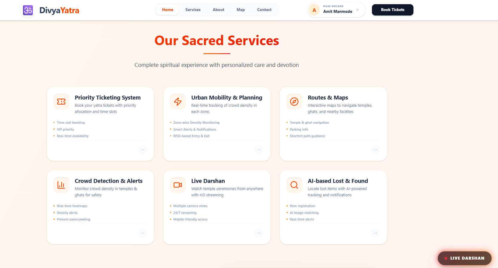
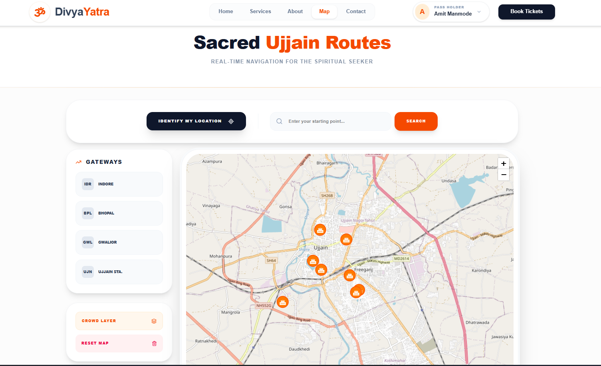
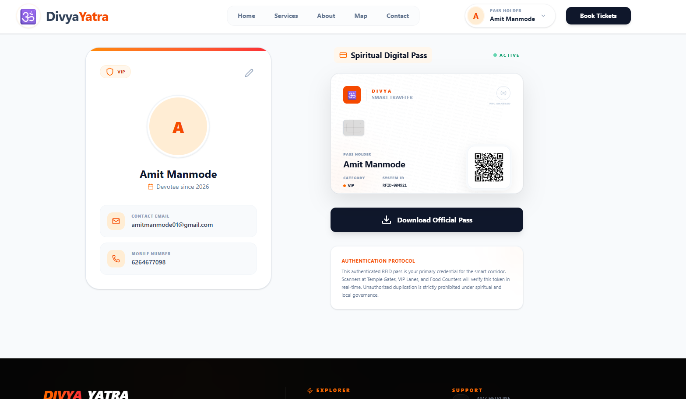

# 🕉️ Divya Yatra | Ujjain Smart Pilgrim Assistant

[](https://vitejs.dev/)
[](https://nodejs.org/)
[](https://www.mongodb.com/)
[](https://lucide.dev/)

**Divya Yatra** is a state-of-the-art pilgrim management system designed specifically for the holy city of Ujjain. It leverages modern web technologies and AI-powered insights to provide a seamless, safe, and spiritually enriching experience for millions of devotees.

---

## ✨ Key Features

### 🛡️ Smart Crowd Management
Real-time density monitoring across various temple zones. The AI detection engine provides fallback metrics to ensure safety even during peak hours (e.g., Mahashivratri).

### 🎫 Priority Ticketing System
Avoid long queues with our digital ticketing platform. Secure your darshan slot and receive instant QR codes for entry verification.

### 🗺️ Interactive Route Guidance
Dynamic maps and flow analysis help devotees navigate the temple corridors efficiently, minimizing congestion and travel time.

### 📦 Lost & Found Repository
A centralized digital vault to report and claim lost items. Integrated with user profiles to ensure items find their way back to the rightful owners.

### 🖥️ Master Admin Console
A powerful control center for administrators to monitor system health, gate flow, ticketing revenue, and security alerts from a single glass pane.

---

## 📸 visual Gallery

<div align="center">
  
  
  <br />
  
  
</div>

---

## 🛠️ Technology Stack

| Layer | Technologies |
| :--- | :--- |
| **Frontend** | React 19, Vite, Vanilla CSS (Glassmorphism), Lucide React |
| **Backend** | Node.js, Express.js, Multer (File Handling) |
| **Database** | MongoDB Atlas, Mongoose ODM |
| **Auth** | JWT (JSON Web Tokens), Google OAuth integration |
| **DevOps** | Render (Backend), Vercel (Frontend) |

---

## 🚀 Getting Started

### Prerequisites
- Node.js (v18+)
- MongoDB (Local or Atlas)

### Setup Instructions

1. **Clone the Repository**
   ```bash
   git clone https://github.com/your-repo/DivineRoute-Assist.git
   cd DivineRoute-Assist
   ```

2. **Backend Configuration**
   ```bash
   cd Backend
   npm install
   # Create a .env file with your mongo URI
   npm start
   ```

3. **Frontend Configuration**
   ```bash
   cd ../Frontend
   npm install
   npm run dev
   ```

---

## 🤝 Contributing
We welcome contributions to make **Divya Yatra** even better! Feel free to fork the repo and submit pull requests.

---

<p align="center">
  Developed with ❤️ for the devotees of Mahakaal.
</p>
